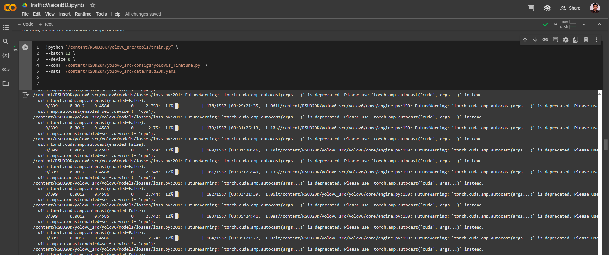

## License

This work is for research purposes and non-commercial use only. See [Attribution-NonCommercial 4.0 International (CC BY-NC 4.0)](https://creativecommons.org/licenses/by-nc/4.0/)


----
# TrafficVision BD 🚦  
*AI-Powered Traffic Management for Bangladesh’s Roads*


*Image credit: The Daily Star*


---

## 🌐 Connect with Me
- **LinkedIn**: [linkedin.com/in/povashrafulhossain/](https://www.linkedin.com/in/povashrafulhossain/)
  
- **Personal Website**: [Google Sites](https://sites.google.com/view/povashrafulhossain)
  
- **Email**: [ashrafulhossainwork@gmail.com](mailto:ashrafulhossainwork@gmail.com)
  

---

## What I'm Working On

- **TrafficVisionBD**: The project focuses on detecting and analyzing traffic elements such as vehicles, traffic signs, intersections, jaywalking, illegal parking, and more. 
    - **Current Focus**: Data collection and annotation (over 20,000 images and diverse datasets).
    - **Future Goal**: Develop and deploy a real-time traffic management system using deep learning models and computer vision techniques.

## Demo Videos (Inspiration from Researchers/Creators)

Below are some demo videos from researchers and creators whose work aligns with the objectives of this project and provides valuable insights into the technologies and approaches I plan to use:

1. **[Traffic Flow and Vehicle Detection using YOLO](https://www.youtube.com/watch?v=H7g7elewctk)**: A demonstration of traffic detection using YOLO-based models. This video showcases real-time object detection, a key technique I aim to implement in **TrafficVisionBD**.
   
2. **[Road Sign Detection and Segmentation](https://www.youtube.com/watch?v=SJG3pRjNH7Q)**: This video showcases advanced segmentation models for detecting road markers and traffic signs. Such models are essential for handling the complexities of traffic environments, which I plan to incorporate into my system.

## What I Aim to Achieve

These demo videos serve as inspiration for my work. Through **TrafficVisionBD**, I aim to:
- Enable real-time vehicle detection and traffic analysis.
- Improve safety and efficiency in urban traffic management.
- Build AI-driven systems that adapt to dynamic road conditions and provide real-time traffic solutions.


---

## 📢 Project Updates
*Stay tuned for future updates!*

Update Version 1.0 [10 Nov, 2024]= https://povashraful.notion.site/dataset <br/>
Update Version 1.1 [24 Nov, 2024] = https://povashraful.notion.site/literature-review<br/>
Update Version 1.2 [30 Nov, 2024] = https://povashraful.notion.site/road-accidents-eda<br/><br/>

Update Version 1.2 [30 Nov, 2024] = Trying to train models on the dataset:



Welcome to **TrafficVision BD**, an AI-driven project aimed at transforming traffic management and road safety in Bangladesh. This project leverages machine learning, computer vision, and data analysis to address the unique challenges of Bangladesh's congested roads and unpredictable traffic patterns.


What will we use? 

Machine Learning + Deep Learning + Reinforcement Learning + Computer Vision

By focusing on these key areas, TrafficVision BD aims to make roads safer and more organized for all users.


# 📺 Featured YouTube Videos

[](https://www.youtube.com/watch?v=QPipnka0E7Q&t=389s)<br/><br/><br/><br/>

## Dataset Website (Collected datasets has been made public for now)
https://povashraful.notion.site/Datasets-for-TrafficVisionBD-Unfiltered-13a2c788fce380849917e4c9206db3fe?pvs=74


## 📚 How to Use
1. **Clone the Repository**:
   ```bash
   git clone https://github.com/yourusername/TrafficVisionBD.git

ps. This readme was made by the help of ChatGPT 


Feel free to explore the repository, watch the videos, and reach out if you’re interested in collaborating or providing feedback!
