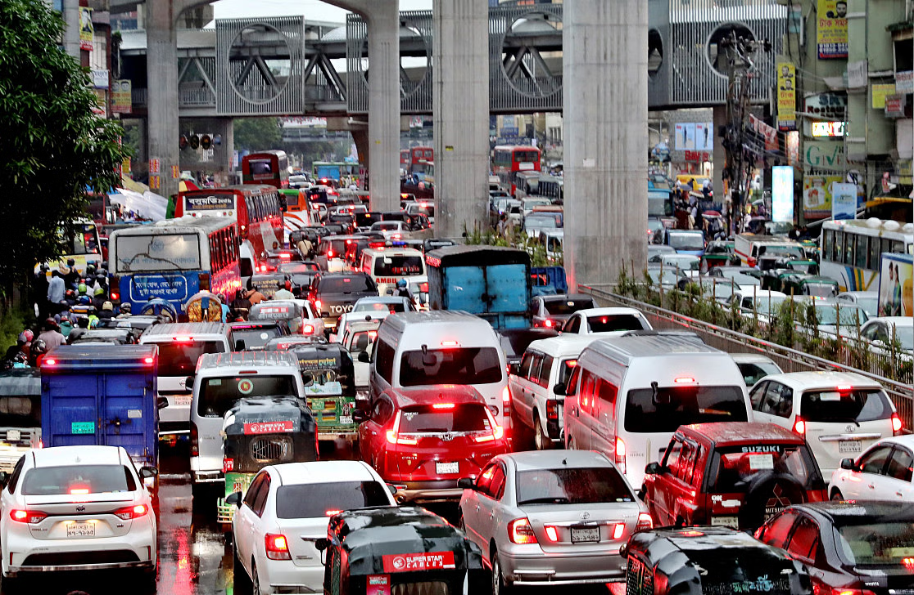

# TrafficVision BD 🚦  
*AI-Powered Traffic Management for Bangladesh’s Roads*


*Image credit: The Daily Star*

---

## 🌐 Connect with Me
- **LinkedIn**: [linkedin.com/in/povashrafulhossain/](https://www.linkedin.com/in/povashrafulhossain/)
  
- **Personal Website**: [Google Sites](https://sites.google.com/view/povashrafulhossain)
  
- **Email**: [ashrafulhossainwork@gmail.com](mailto:ashrafulhossainwork@gmail.com)
  

---

## 📢 Project Updates
*Stay tuned for future updates!*


Welcome to **TrafficVision BD**, an AI-driven project aimed at transforming traffic management and road safety in Bangladesh. This project leverages machine learning, computer vision, and data analysis to address the unique challenges of Bangladesh's congested roads and unpredictable traffic patterns.


## 🌟 Project Overview
TrafficVision BD is designed to:
- **Analyze Traffic Flow**: Using object detection to monitor and analyze real-time traffic data.
- **Predict Accident-Prone Areas**: Applying time series analysis to identify high-risk zones based on traffic patterns and historical data.
- **Detect Traffic Violations**: Automatically flagging violations like illegal parking, jaywalking, and helmet non-compliance.

By focusing on these key areas, TrafficVision BD aims to make roads safer and more organized for all users.


# 📺 Featured YouTube Videos

[](https://www.youtube.com/watch?v=QPipnka0E7Q&t=389s)<br/><br/><br/><br/>


## 📈 Key Features
- **Object Detection**: Identification of different types of vehicles, road markings, and pedestrians in real-time.
- **Time Series Analysis**: Forecasts traffic congestion and potential accident hotspots based on historical trends.
- **Violation Detection**: Flags common violations such as helmet non-compliance, jaywalking, and illegal parking.
  
  
## 🔍 Problem Statement
In Bangladesh, traffic congestion, frequent accidents, and a lack of reliable traffic data pose significant challenges. Roads are filled with a variety of vehicles, from buses to rickshaws, often on unmarked and overcrowded streets. TrafficVision BD is developed to provide a tailored solution that reflects these local road dynamics and helps create a safer, more efficient traffic system.


## 🚀 Current Progress
Currently, the project is in the **data collection phase**, gathering comprehensive data on:
- Vehicle counts
- Traffic patterns
- Accident-prone zones
- Common violations

This dataset will be foundational for training the AI models that power TrafficVision BD’s object detection and time series analysis.


## 🛠️ Tech Stack
- **Python**: Core programming language for data processing and model development.
- **OpenCV**: Image processing and computer vision.
- **TensorFlow/PyTorch**: For building and training machine learning models.
- **NumPy & Pandas**: Data manipulation and analysis.
- **Matplotlib & Seaborn**: Visualization of traffic patterns and insights.
  

## 📌 Future Plans
Here’s what’s next for TrafficVision BD:
- **Enhanced Object Detection**: Fine-tuning the model for better accuracy on congested roads.
- **Accident Prediction Models**: Developing models that can accurately predict accident-prone areas.
- **Real-Time Implementation**: Deploying TrafficVision BD in real-time for continuous monitoring and insights.
- **Policy Support and Urban Planning**: Providing actionable insights for city planners and policymakers to improve infrastructure and safety.
  

## 📚 How to Use
1. **Clone the Repository**:
   ```bash
   git clone https://github.com/yourusername/TrafficVisionBD.git

ps. This readme was made by the help of ChatGPT 
